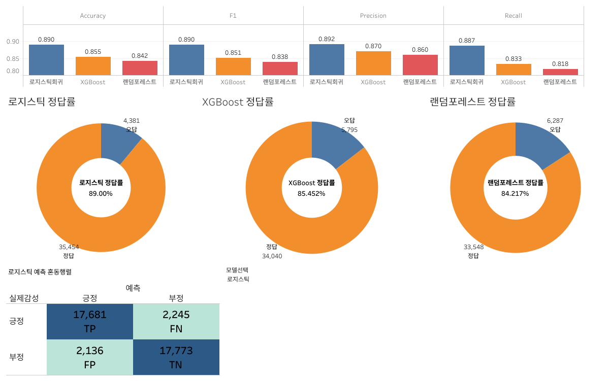
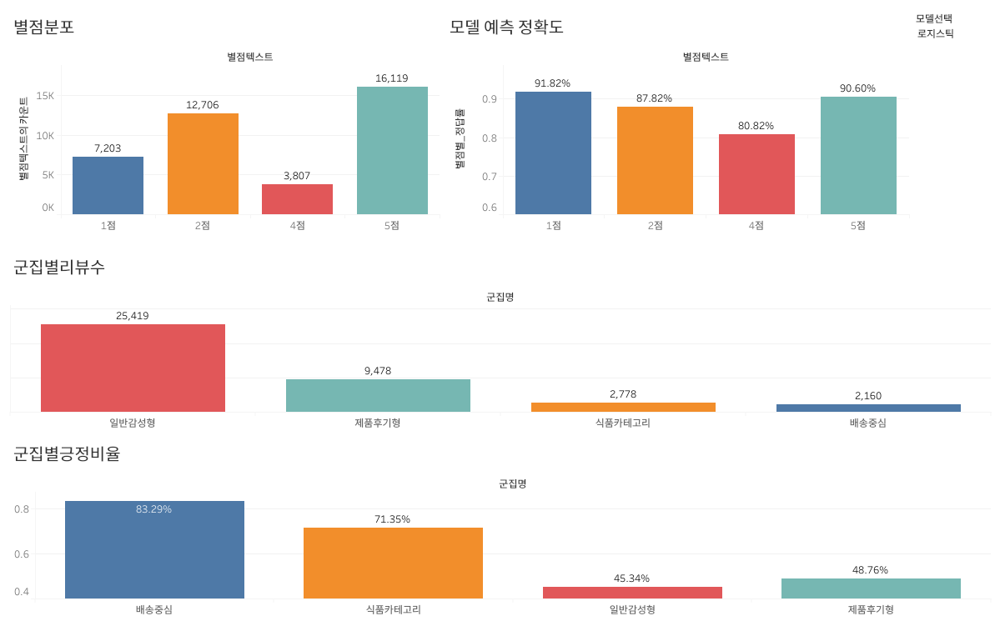
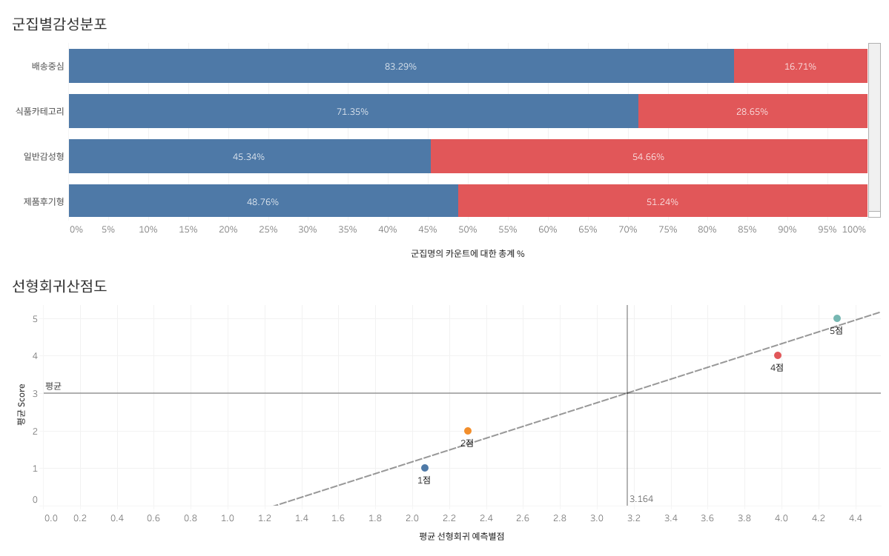
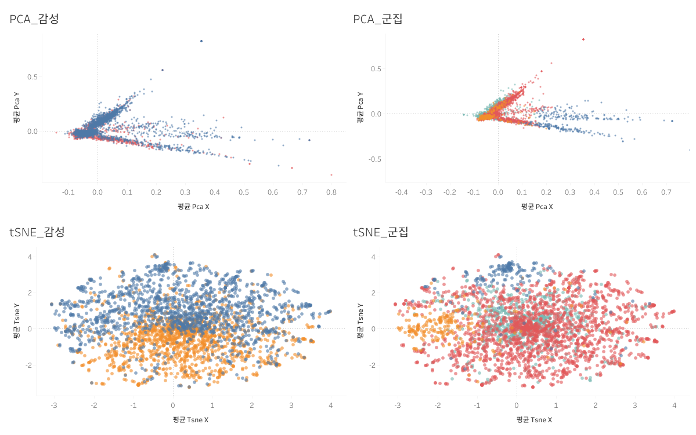

# 🛒 네이버 쇼핑 리뷰 감성 분석 ML 프로젝트

[](https://www.python.org/)
[](https://pandas.pydata.org/)
[](https://scikit-learn.org/)
[](https://konlpy.org/)
[](https://xgboost.readthedocs.io/)
[](https://public.tableau.com/)

네이버 쇼핑 리뷰 약 20만 건을 대상으로 **자연어 처리 → 지도학습(분류·회귀) → 비지도학습(군집화) → Tableau 시각화** 파이프라인을 구축한 머신러닝 프로젝트입니다.

---

## 목차

1. [프로젝트 개요](#프로젝트-개요)
2. [기술 스택](#기술-스택)
3. [프로젝트 구조](#프로젝트-구조)
4. [분석 파이프라인](#분석-파이프라인)
5. [모델 성능](#모델-성능)
6. [Tableau 대시보드](#tableau-대시보드)
7. [주요 인사이트](#주요-인사이트)

---

## 프로젝트 개요

| 항목 | 내용 |
|------|------|
| **데이터** | 네이버 쇼핑 리뷰 (`naver_shopping.txt`, 약 200,000건) |
| **태스크** | 감성 분류(긍/부정), 별점 예측(회귀), 리뷰 군집화 |
| **형태소 분석** | KoNLPy Okt — 어간 추출(`좋아요 → 좋다`) |
| **특징 추출** | TF-IDF (max_features=10,000, ngram_range=(1,2)) |
| **시각화** | Tableau Public 대시보드 4개 |

---

## 기술 스택

| 분류 | 도구 |
|------|------|
| 언어 | Python 3.10 |
| 데이터 처리 | Pandas, NumPy, SciPy |
| 자연어 처리 | KoNLPy (Okt), Scikit-learn TfidfVectorizer |
| 지도학습 | Logistic Regression, Random Forest, XGBoost, Linear Regression |
| 비지도학습 | K-Means, PCA, t-SNE |
| 시각화 | Matplotlib, Seaborn, Tableau Public |

---

## 프로젝트 구조

```
shopping_review_ml/
├── data/
│   ├── naver_shopping.txt          # 원본 리뷰 데이터
│   ├── reviews_eda.csv             # EDA용 정제 데이터
│   └── preprocessed/               # 전처리 결과물 (TF-IDF, 레이블)
├── notebooks/
│   ├── 01_EDA.ipynb                # 탐색적 데이터 분석
│   ├── 02_preprocessing_okt.ipynb  # Okt 형태소 분석 + TF-IDF
│   ├── 03_supervised.ipynb         # 지도학습 (분류·회귀)
│   ├── 04_unsupervised.ipynb       # 비지도학습 (K-Means, PCA, t-SNE)
│   └── 05_export.ipynb             # Tableau 수출 CSV 생성
├── output/
│   ├── supervised_results.csv      # 분류 예측 결과
│   ├── unsupervised_results.csv    # 군집화 결과
│   ├── tableau_main.csv            # Tableau 메인 데이터
│   ├── tableau_tsne.csv            # Tableau t-SNE 데이터
│   └── model_metrics.csv           # 모델 평가 지표
└── docs/
    ├── dashboard1.png ~ dashboard4.png
```

---

## 분석 파이프라인

```
원본 데이터
    │
    ▼
01 EDA ──────────── 별점 분포, 리뷰 길이, 상위 단어 시각화
    │
    ▼
02 전처리 ────────── Okt 형태소 분석 → TF-IDF 행렬 생성 → train/test 분리
    │
    ├──▶ 03 지도학습 ── 로지스틱 회귀 / Random Forest / XGBoost / 선형 회귀
    │
    ├──▶ 04 비지도학습 ── K-Means(k=4) 군집화 → PCA 2D → t-SNE 2D
    │
    ▼
05 Export ────────── tableau_main.csv / tableau_tsne.csv 병합 출력
    │
    ▼
Tableau 대시보드
```

---

## 모델 성능

### 분류 모델 (이진 감성 분류: 긍정/부정)

| 모델 | Accuracy | F1-Score | Precision | Recall |
|------|:--------:|:--------:|:---------:|:------:|
| **Logistic Regression** | **0.8900** | **0.8898** | 0.8921 | 0.8876 |
| XGBoost | 0.8545 | 0.8514 | 0.8643 | 0.8389 |
| Random Forest | 0.8422 | 0.8383 | 0.8601 | 0.8176 |

### 회귀 모델 (별점 예측: 1~5점)

| 모델 | MAE | RMSE | R² |
|------|:---:|:----:|:--:|
| Linear Regression | 0.8159 | 1.0577 | 0.5866 |

> Logistic Regression이 가장 높은 정확도(89.00%)를 기록하였으며, 혼동 행렬 기준 TP 17,681 / TN 17,773으로 긍/부정 모두 균형 있게 예측합니다.

---

## Tableau 대시보드

[](https://public.tableau.com/views/shopping_review_ml/sheet15?:language=ko-KR&:sid=&:redirect=auth&:display_count=n&:origin=viz_share_link)

---

### 대시보드 1 — 모델 성능 비교

3가지 분류 모델의 Accuracy·F1·Precision·Recall 막대 차트, 도넛 차트(로지스틱 89.00% / XGBoost 85.45% / RF 84.22%), 로지스틱 회귀 혼동 행렬을 한눈에 비교합니다.



---

### 대시보드 2 — 별점 분포 & 군집 분석

별점별 리뷰 수(1점 7,203 / 2점 12,706 / 4점 3,807 / 5점 16,119), 별점별 예측 정확도(1점 91.82% / 5점 90.60% / 2점 87.82% / 4점 80.82%), 군집별 리뷰 수(일반감성형 25,419 / 제품후기형 9,478 / 식품카테고리 2,778 / 배송중심 2,160)를 시각화합니다.



---

### 대시보드 3 — 군집별 감성 분포 & 선형 회귀 산점도

군집별 긍/부정 비율 누적 막대 차트와 별점별 평균 회귀 예측값 산점도를 통해 군집 특성과 회귀 모델 성능을 분석합니다.

| 군집 | 긍정 비율 | 특성 |
|------|:---------:|------|
| 배송중심 | **83.29%** | 배송 관련 리뷰, 긍정 편향 |
| 식품카테고리 | **71.35%** | 식품 카테고리 리뷰 |
| 제품후기형 | 48.76% | 균형 잡힌 제품 평가 |
| 일반감성형 | 45.34% | 부정 다소 우세 |



---

### 대시보드 4 — PCA & t-SNE 2D 시각화

PCA와 t-SNE로 축소된 2차원 공간에서 감성(긍/부정) 및 군집 레이블로 채색한 분포도 4종을 표시합니다. 감성별 분리 패턴과 군집 경계를 직관적으로 확인할 수 있습니다.



---

## 주요 인사이트

- **Okt 어간 추출 효과**: `좋아요 → 좋다` 등 어간 정규화를 통해 어휘 중복 제거, Recall 향상
- **별점 1·5점 고정확도**: 극단적 감성(1점 91.82%, 5점 90.60%)은 모델이 명확히 구분하나, 중간 별점(4점 80.82%)은 상대적으로 어려움
- **배송 클러스터 긍정 편향**: 배송중심 군집(83.29% 긍정)은 배송 만족도가 전반적으로 높음을 시사
- **선형 회귀 한계**: R² 0.5866 — 별점 예측은 분류보다 어려우며, 중간 별점(2~4점) 구간 예측 오차가 큼
